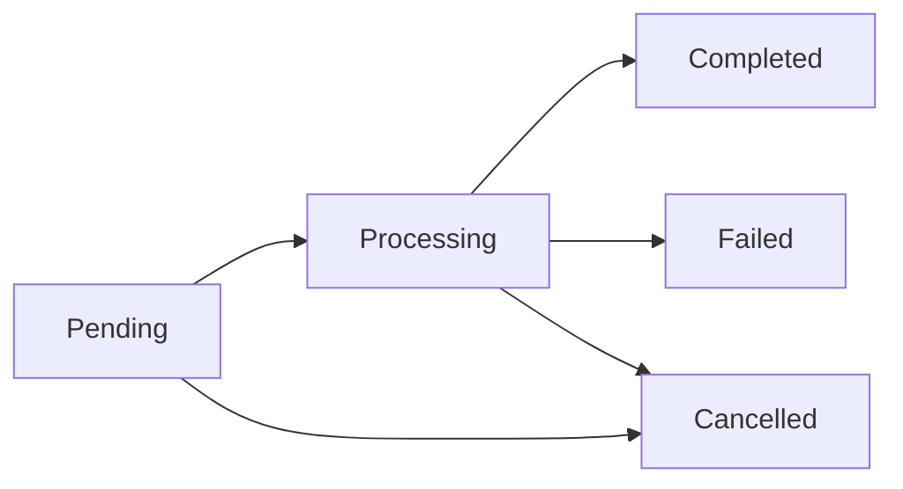

## Overview

The Reducto SDK provides comprehensive job management capabilities for tracking asynchronous document processing operations. You can retrieve individual jobs, list all jobs, and cancel running jobs.

## Get a Specific Job

Retrieve the status and results of a specific job using its job ID:

```python
from reducto import Reducto

client = Reducto()

# Get job by ID
job = client.job.get(job_id="job_abc123")

print(f"Job status: {job.status}")
if job.status == "completed":
    print(f"Result: {job.result}")
```

### Job Response

The job response includes:
- `job_id`: Unique identifier for the job
- `status`: Current status (pending, processing, completed, failed, cancelled)
- `result`: The processing result (when status is completed)
- `error`: Error details (when status is failed)
- `created_at`: Job creation timestamp
- `completed_at`: Job completion timestamp (when applicable)

## Get All Jobs

Retrieve a list of all your jobs with pagination support:

```python
from reducto import Reducto

client = Reducto()

# Get first page of jobs
response = client.job.get_all(
    limit=100  # Max 500, defaults to 100
)

for job in response.jobs:
    print(f"Job {job.job_id}: {job.status}")

# Check if there are more results
if response.next_cursor:
    print(f"Next page cursor: {response.next_cursor}")
```

### Pagination

Use the `cursor` parameter to fetch subsequent pages:

```python
# Get first page
response = client.job.get_all(limit=100)

# Get next page using cursor from previous response
if response.next_cursor:
    next_page = client.job.get_all(
        cursor=response.next_cursor,
        limit=100
    )
```

### Exclude Configurations

Reduce response size by excluding configuration details:

```python
response = client.job.get_all(
    limit=100,
    exclude_configs=True  # Omit raw_config from response
)
```

### Parameters

<ParamField path="limit" type="int" default="100">
  Maximum number of jobs to return per page (max 500)
</ParamField>

<ParamField path="cursor" type="str" optional>
  Cursor for pagination. Use the `next_cursor` from the previous response to fetch the next page.
</ParamField>

<ParamField path="exclude_configs" type="bool" default="false">
  Exclude raw_config from response to reduce size
</ParamField>

## Cancel a Job

Cancel a running or pending job:

```python
from reducto import Reducto

client = Reducto()

# Cancel a job
client.job.cancel(job_id="job_abc123")

print("Job cancelled successfully")
```

<Note>
  You can only cancel jobs that are in `pending` or `processing` status. Completed, failed, or already cancelled jobs cannot be cancelled.
</Note>

## Async Job Management

All job operations work with the async client:

```python
import asyncio
from reducto import AsyncReducto

client = AsyncReducto()

async def main():
    # Get a job
    job = await client.job.get(job_id="job_abc123")
    print(f"Status: {job.status}")
    
    # Get all jobs
    response = await client.job.get_all(limit=50)
    for job in response.jobs:
        print(f"Job {job.job_id}: {job.status}")
    
    # Cancel a job
    await client.job.cancel(job_id="job_abc123")

asyncio.run(main())
```

## Complete Example: Job Polling

Here's a complete example of submitting a job and polling for completion:

```python
import time
from reducto import Reducto

client = Reducto()

# Submit an async job
response = client.parse.run(
    input="https://pdfobject.com/pdf/sample.pdf",
)

job_id = response.job_id
print(f"Submitted job: {job_id}")

# Poll for completion
while True:
    job = client.job.get(job_id=job_id)
    
    if job.status == "completed":
        print("Job completed!")
        print(f"Result: {job.result}")
        break
    elif job.status == "failed":
        print(f"Job failed: {job.error}")
        break
    elif job.status == "cancelled":
        print("Job was cancelled")
        break
    else:
        print(f"Job status: {job.status}")
        time.sleep(5)  # Wait 5 seconds before checking again
```

## Job Lifecycle

Jobs progress through the following states:



1. **Pending**: Job is queued and waiting to start
2. **Processing**: Job is currently being processed
3. **Completed**: Job finished successfully
4. **Failed**: Job encountered an error
5. **Cancelled**: Job was cancelled by user request

## Best Practices

<AccordionGroup>
  <Accordion title="Use Webhooks for Production">
    Instead of polling for job completion, configure webhooks to receive notifications when jobs complete. See [Webhooks](/advanced/webhooks) for details.
  </Accordion>
  
  <Accordion title="Implement Exponential Backoff">
    When polling for job status, use exponential backoff to reduce API calls:
    ```python
    import time
    
    delay = 1
    max_delay = 60
    
    while True:
        job = client.job.get(job_id=job_id)
        if job.status in ["completed", "failed", "cancelled"]:
            break
        time.sleep(delay)
        delay = min(delay * 2, max_delay)
    ```
  </Accordion>
  
  <Accordion title="Clean Up Old Jobs">
    Periodically retrieve and clean up old completed jobs to keep your job list manageable:
    ```python
    response = client.job.get_all(limit=500)
    for job in response.jobs:
        if job.status == "completed" and is_old(job.completed_at):
            # Process or archive the result
            pass
    ```
  </Accordion>
  
  <Accordion title="Handle Pagination">
    When retrieving all jobs, always handle pagination to ensure you process all results:
    ```python
    cursor = None
    all_jobs = []
    
    while True:
        response = client.job.get_all(cursor=cursor, limit=500)
        all_jobs.extend(response.jobs)
        
        if not response.next_cursor:
            break
        cursor = response.next_cursor
    ```
  </Accordion>
</AccordionGroup>

## Related

- [Webhooks](/advanced/webhooks) - Configure webhooks for job completion notifications
- [Async Support](/concepts/async-support) - Learn about async patterns in the SDK
- [Error Handling](/concepts/error-handling) - Handle job failures gracefully
